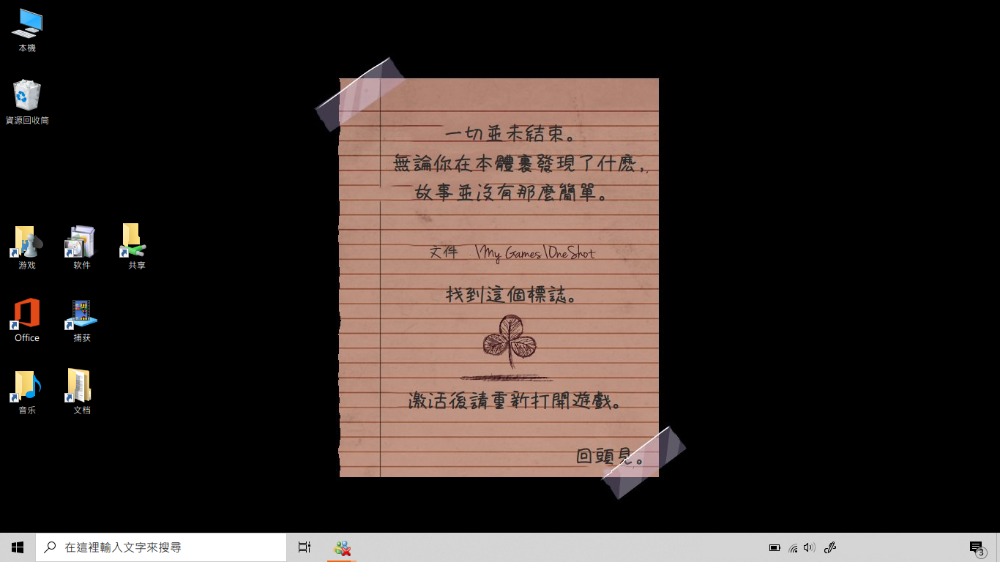
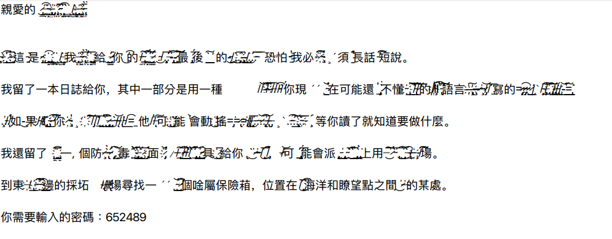
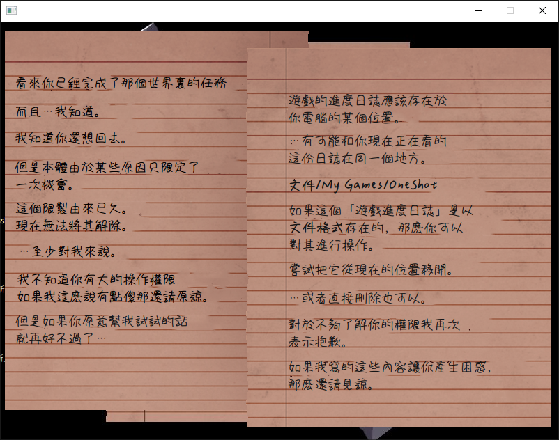
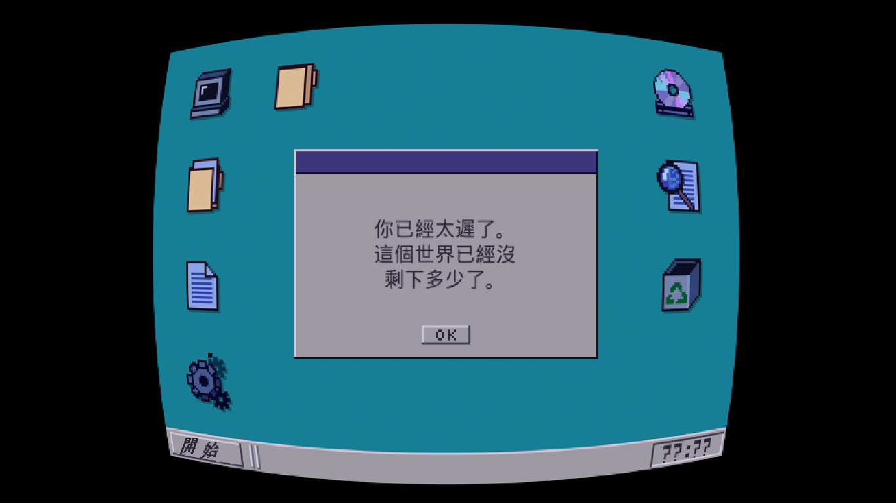
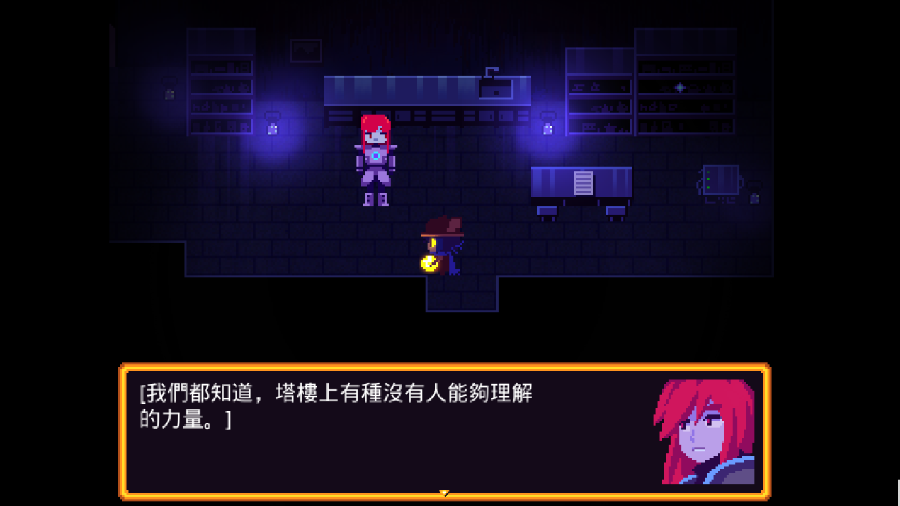

# OneShot Zh-Hant

[English Docs](https://github.com/WindowsShould/OneShot-Zh-Hant/blob/master/README_en.us.md)
#### 介紹
為 OneShot 添加 中文（繁體）支持。😅

#### 相關
通過更換 中文（簡體）的相關文件以添加 中文（繁體）的支持。因而不支持 中文（簡體）與 中文（繁體）共存。 
#### 安裝

1.  下載 `release` 中的 `OneShot.zip`
2.  解壓，並將其覆蓋至 `Steam 安裝目錄`中的 `OneShot 文件夾`。
- **註意❕：裏面文件夾選擇合並，文件選擇覆蓋** 
- **警告❗：在替換前先做好備份！** 

#### 演示

